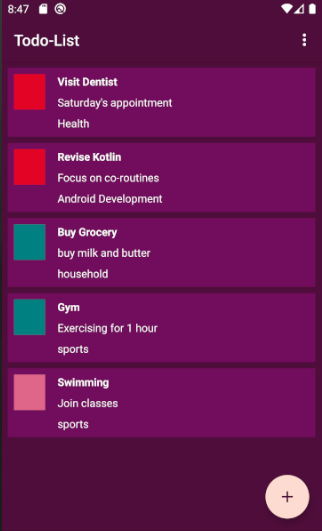
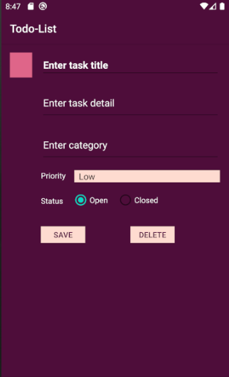

# Todo-List
Simple To-do list created using room implementing MVVM architecture.

Can view the screenshots of the application below

## Task List Screen

## Add Task Screen

*You need to have android studio installed on your device and create an Android Virtual Device to run full Android OS and test the application.*
